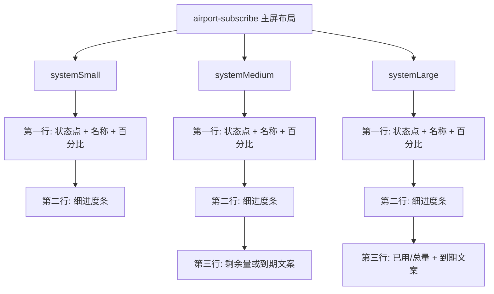

# airport-subscribe 进度条展示改造方案

## 1. 背景

目标文件：

- `modules/airport-subscribe.js`

当前组件已经具备以下能力：

- 数据层可稳定拿到 `usedBytes / totalBytes / remainingBytes`
- 视图模型已产出 `progress / percent / accent / trackColor / gradient`
- 主屏尺寸已经完成平铺化，避免了复杂卡片重叠

当前问题不在数据，而在信息表达：

- 每个机场目前主要依赖 `XX%` 或 `已用 / 总量` 的纯文本表达
- 当订阅数量较多时，用户需要逐行读数字，无法快速识别“谁快用完了”

本次目标是在不重构数据层的前提下，为每个机场增加轻量进度条，让流量使用情况一眼可读。

## 2. 设计原则

1. 只改布局层和少量视图模型文案，不改抓取、缓存、排序、容错。
2. 进度条必须是“细条”，不能重新引入大卡片，避免回到旧版拥挤问题。
3. 进度条颜色继续沿用当前 `accent / trackColor / level` 体系，保证风险感知一致。
4. 小尺寸优先保可读性，不强行给锁屏尺寸塞复杂条形。
5. 当数据不可用时，不绘制误导性的空进度条，统一展示失败文案。

## 3. 推荐方案

### 3.1 `systemSmall`

保留 2 条紧凑行，但每条从“单行文本”升级为“两层结构”：

- 第一行：状态点 + 机场名称 + `percentText`
- 第二行：细进度条

展示规则：

- 只显示前 2 个优先级最高的机场
- 进度条高度建议 `4`
- 仅显示已用比例，不额外塞入 `trafficText`，避免拥挤

适用原因：

- 小尺寸最缺高度，保留名称和百分比，把数字摘要压缩为视觉条，比继续展示完整 `compactText` 更直观

### 3.2 `systemMedium`

保留现有双列平铺结构，但每个机场改为“三层结构”：

- 第一行：状态点 + 名称 + `percentText`
- 第二行：进度条
- 第三行：`subtitle` 或 `expiryText`

展示规则：

- 最多 4 个机场
- 每列 2 个左右
- 进度条高度建议 `5`
- 副文案优先显示 `剩余 xx`，到期风险高时切到 `expiryText`

适用原因：

- 中号尺寸足够容纳轻量三层结构
- 用户可以在一屏内同时比较多个机场的使用水位

### 3.3 `systemLarge`

保留现在的汇总行和列表结构，把展开行升级为“信息 + 进度条 + 明细”三段式：

- 第一行：状态点 + 名称 + `percentText`
- 第二行：进度条
- 第三行：`trafficText · expiryText`

展示规则：

- 最多 5 到 6 个机场
- 进度条高度建议 `6`
- 大号尺寸允许展示完整数值，兼顾视觉和精确信息

适用原因：

- 大尺寸不需要牺牲明细，可以同时保留进度条和详细文本

### 3.4 `accessory` 尺寸

不建议本次改造：

- `accessoryCircular` 已经通过中心百分比表达焦点机场状态
- `accessoryRectangular` 和 `accessoryInline` 空间有限，引入条形会挤压主要文字

建议保持现状，只优化主屏尺寸。

## 4. 函数级改造点

### 4.1 复用现有视图模型字段

无需新增核心数据字段，直接复用：

- `item.progress`
- `item.percentText`
- `item.accent`
- `item.trackColor`
- `item.isUsable`

可选增强：

- 为进度条补一个 `barFillColor`，但不是必须，当前 `accent` 已足够

### 4.2 新增统一进度条组件

建议在 `modules/airport-subscribe.js` 基础工具区附近新增：

- `subscriptionUsageBar(item, height)`

建议实现特征：

- `direction: "row"`
- 外层使用 `item.trackColor`
- 内层使用 `item.accent`
- 填充宽度由 `item.progress` 决定
- 最小填充 `Math.max(0.02, item.progress)`，避免极小占比完全不可见
- 当 `!item.isUsable` 时直接返回错误文案或跳过绘制

### 4.3 调整现有行组件

建议调整而不是重写布局入口：

- `subscriptionCompactRow(item, compact)`
- `subscriptionExpandedRow(item)`

改造方向：

1. `subscriptionCompactRow`
   - 现状：单行 `tagDot + name + trailing`
   - 目标：改为 `vstack`
   - 内部第一行继续保留 `hstack(tagDot + name + percentText)`
   - 内部第二行放进度条
   - 中号尺寸可追加一行副文案，小号尺寸省略

2. `subscriptionExpandedRow`
   - 现状：两行文本
   - 目标：三层结构
   - 第一行信息
   - 第二行进度条
   - 第三行明细文案

### 4.4 调整紧凑文案策略

当前字段：

- `compactText = percent + "% · " + compactExpiry(...)`

进度条引入后，建议减少重复：

- `systemSmall` 第一行右侧仅保留 `percentText`
- `systemMedium` 第三行展示 `subtitle` 或 `expiryText`
- `systemLarge` 保留 `trafficText · expiryText`

这样可以避免“已经有进度条，还重复塞大量数字”的信息冗余。

## 5. Mermaid 结构图



## 6. 风险与边界情况

### 6.1 拉取失败

问题：

- 失败项没有真实进度，不能画 `0%` 条形，否则会误导为“还有很多流量”

方案：

- `!item.isUsable` 时不显示进度条
- 保持当前 `拉取失败` 和错误文案

### 6.2 极低占比

问题：

- 使用率很低时，进度条可能肉眼不可见

方案：

- 条形填充最小值设置为 `0.02`

### 6.3 已过期但流量未耗尽

问题：

- 这种场景核心风险是到期，不是流量余量

方案：

- 颜色继续走 `danger`
- 文案优先显示 `已到期`
- 进度条仍反映已用比例，但视觉颜色必须明显偏危险色

### 6.4 高订阅数量

问题：

- 进度条会让单项高度上升，可能影响列表数量

方案：

- `systemSmall` 仍限制 2 条
- `systemMedium` 仍限制 4 条
- `systemLarge` 可视情况从 6 条降为 5 条，优先保证不拥挤

## 7. 实施顺序

1. 新增 `subscriptionUsageBar(item, height)` 通用组件
2. 改造 `subscriptionCompactRow(item, compact)`
3. 改造 `subscriptionExpandedRow(item)`
4. 微调 `buildSmall / buildMedium / buildLarge` 的间距
5. 检查不同状态色在深色背景上的对比度

## 8. 验证方式

### 8.1 结构验证

执行命令：

```sh
node --input-type=module -e 'import widget from "./modules/airport-subscribe.js"; const mkHeaders = (v) => ({ get: (k) => String(k || "").toLowerCase() === "subscription-userinfo" ? v : "" }); const values = ["upload=1073741824; download=1073741824; total=10737418240; expire=1792310400","upload=7516192768; download=2147483648; total=10737418240; expire=1792310400","upload=9663676416; download=536870912; total=10737418240; expire=1792310400"]; const env = { TITLE: "机场订阅洞察", SUBSCRIPTIONS_JSON: JSON.stringify(values.map((_, i) => ({ name: "机场" + (i + 1), url: "https://sub.example.com/" + i, siteUrl: "https://airport.example.com" }))) }; const base = { env, storage: { getJSON() { return null; }, setJSON() {} }, http: { head: async function (url) { const i = Number(String(url).split("/").pop()) || 0; return { status: 200, headers: mkHeaders(values[i]) }; }, get: async function (url) { const i = Number(String(url).split("/").pop()) || 0; return { status: 200, headers: mkHeaders(values[i]) }; } } }; for (const family of ["systemSmall", "systemMedium", "systemLarge"]) { const res = await widget({ ...base, widgetFamily: family }); console.log(family + ":" + JSON.stringify(res).includes("\"height\":4") + ":" + JSON.stringify(res).includes("\"height\":5") + ":" + JSON.stringify(res).includes("\"height\":6")); }'
```

预期：

- 主屏尺寸渲染结果中出现进度条高度特征
- 不出现异常或空对象

### 8.2 人工视觉检查

重点检查：

1. 小号尺寸两条记录不会挤压 footer
2. 中号尺寸双列内文本和进度条对齐稳定
3. 大号尺寸 5 到 6 条记录不会发生遮挡
4. `danger / warning / normal` 三类颜色在深色背景下都能快速区分

## 9. 结论

推荐采用“主屏尺寸加细进度条、锁屏尺寸保持现状”的最小改造方案。

这套方案的优点：

- 不动数据层
- 不破坏当前平铺结构
- 能显著提升多机场横向比较效率
- 实现成本低，风险可控

## 10. 实施状态

已于 `2026-03-18` 完成首轮落地，目标文件：

- `modules/airport-subscribe.js`

本次实际实现：

- 新增 `subscriptionUsageBar(item, height)` 统一进度条组件
- `subscriptionCompactRow(item, compact)` 升级为主屏两层/三层结构
- `subscriptionExpandedRow(item)` 升级为信息 + 进度条 + 明细结构
- `systemLarge` 的主屏列表上限从 `6` 调整为 `5`，避免新增进度条后挤压
- 锁屏尺寸 `accessoryCircular / accessoryRectangular / accessoryInline` 保持不变
- 回归修复：移除不符合 DSL 类型约束的 `width: "100%"`，恢复为合法布局属性组合

## 11. 实际验证结果

已执行本地结构验证，结论如下：

1. `systemSmall` 输出中已出现高度为 `4` 的进度条节点。
2. `systemMedium` 输出中已出现高度为 `5` 的进度条节点。
3. `systemLarge` 输出中已出现高度为 `6` 的进度条节点。
4. 混合场景下，失败机场保留 `拉取失败` 与错误文案，未插入额外进度条。
5. 使用用户实际传入的两机场 JSON 做本地渲染验证，`systemSmall / systemMedium / systemLarge` 均能正常返回 widget 结构。
