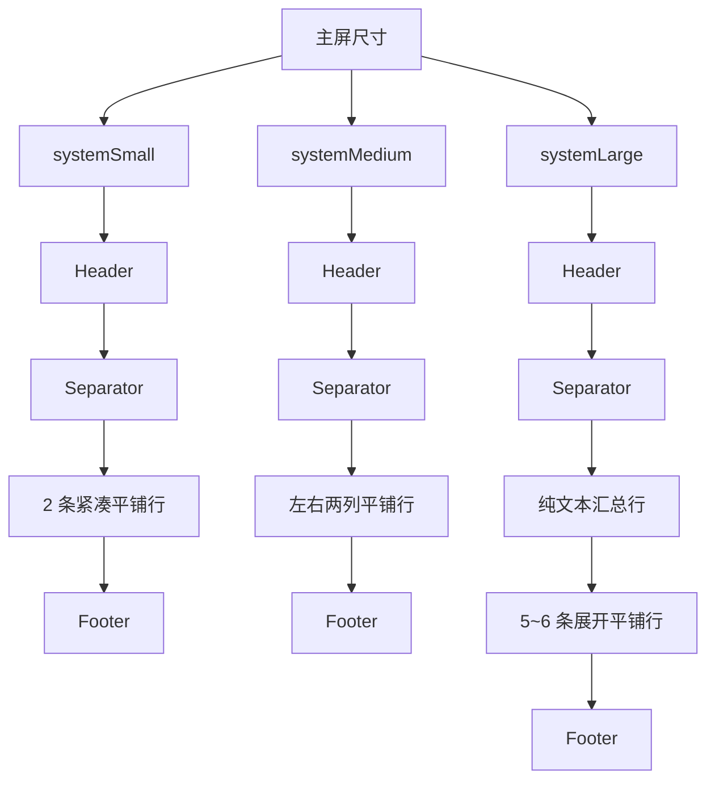

# 机场订阅洞察平铺化改造说明

## 1. 背景

目标文件：

- `modules/airport-subscribe.js`

本次改造目标不是继续压缩复杂卡片，而是把主屏尺寸统一改为平铺结构，直接规避重叠风险。

## 2. 问题根因

旧版主屏布局的问题不在数据，而在结构：

1. `systemSmall` 使用圆环、进度条、状态胶囊，垂直层级过深。
2. `systemMedium` 使用主卡 + 辅助卡双复杂区，动态文本和固定视觉同时争抢高度。
3. `systemLarge` 使用总览卡 + 主卡 + 明细卡的叠加结构，信息层级过重。

结论：

- 继续保留卡片型主视觉，就仍然存在挤压和重叠风险。
- 最稳妥方案是直接改成列表平铺。

## 3. 改造原则

- 主屏尺寸只保留 `header + 平铺列表 + footer`
- 不再使用圆环、进度条、摘要卡、指标卡、备注卡
- 中号布局直接参考 `modules/github-stars.js`
- 所有动态文案都必须单行收缩，优先 `maxLines + minScale`

## 4. 新布局方案

### 4.1 `systemSmall`

- `header`
- `separator`
- 2 条紧凑订阅行
- `footer`

每条行内容：

- 左侧状态点
- 中间订阅名
- 右侧 `compactText`

### 4.2 `systemMedium`

- `header`
- `separator`
- 左右两列平铺行
- `footer`

展示规则：

- 最多 4 条订阅
- 按一半拆成左右两列
- 中间允许 1 条竖向分隔线
- 每条行仍为纯文本平铺，不生成独立背景卡

### 4.3 `systemLarge`

- `header`
- `separator`
- 1 条纯文本汇总行
- 5 到 6 条展开订阅行
- `footer`

展开行内容：

- 第一行：状态点 + 名称 + `percentText`
- 第二行：`trafficText · expiryText`

## 5. Mermaid 结构图



## 6. 实现约束

保留：

- 数据拉取、缓存、排序、容错逻辑
- `SUBSCRIPTIONS_JSON` 及现有环境变量
- 锁屏尺寸 `accessoryCircular / accessoryRectangular / accessoryInline`

删除主屏依赖：

- `heroCard`
- `summaryCard`
- `mediumAsideCard`
- `detailItemRow`
- `compactItemRow`
- `compactItemLine`
- `circularUsage`
- `progressBar`
- `metricBlock`
- `overviewRow`
- `overviewChip`

## 7. 验证方式

### 7.1 本地结构验证

执行命令：

```sh
node --input-type=module -e 'import widget from "./modules/airport-subscribe.js"; const headerValue = "upload=10737418240; download=11811160064; total=137438953472; expire=1792310400"; const headers = { get: (k) => String(k || "").toLowerCase() === "subscription-userinfo" ? headerValue : "" }; const env = { TITLE: "机场订阅洞察", SUBSCRIPTIONS_JSON: JSON.stringify([{ name: "doriya", url: "https://sub.example.com/a", siteUrl: "https://airport.example.com", note: "主力线路" }, { name: "赔钱", url: "https://sub.example.com/b", siteUrl: "https://airport.example.com" }, { name: "备用", url: "https://sub.example.com/c", siteUrl: "https://airport.example.com" }, { name: "收敛", url: "https://sub.example.com/d", siteUrl: "https://airport.example.com" }]) }; const base = { env: env, storage: { getJSON() { return null; }, setJSON() {} }, http: { head: async function () { return { status: 200, headers: headers }; }, get: async function () { return { status: 200, headers: headers }; } } }; for (const family of ["systemSmall","systemMedium","systemLarge"]) { const res = await widget({ ...base, widgetFamily: family }); console.log(family + ":" + JSON.stringify({ topLevel: res.children.length, hasDivider: JSON.stringify(res).includes("\"width\":1"), hasLargeCircle: JSON.stringify(res).includes("\"width\":60") || JSON.stringify(res).includes("\"width\":78") })); }'
```

预期结果：

- `systemSmall / systemMedium / systemLarge` 都能正常输出
- `systemMedium` 只包含平铺列结构，不包含主卡/摘要卡
- 主屏结构中不再出现圆环尺寸 `60/78`

### 7.2 人工视觉验证

重点检查：

1. `systemSmall` 没有圆环、进度条和卡片堆叠。
2. `systemMedium` 左右两列只显示平铺行，长标题不会撞到右侧信息。
3. `systemLarge` 汇总行、列表行、footer 三层不覆盖。
