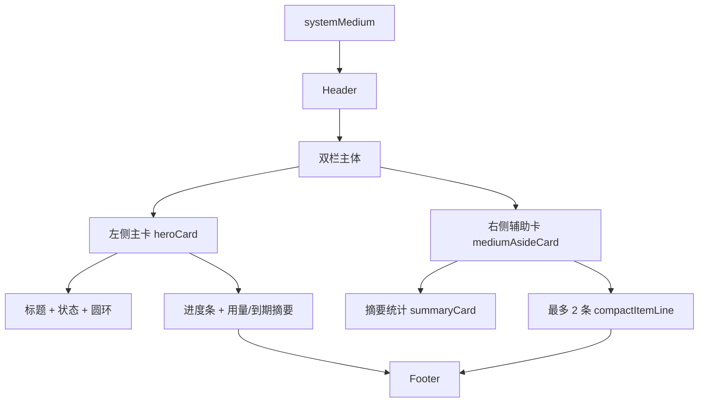

# 机场订阅洞察布局修复说明

## 1. 背景

文件位置：

- `modules/airport-subscribe.js`

本次修复目标不是增加数据展示，而是解决 `systemMedium` 尺寸下的内容重叠、卡片互相挤压、底部状态区侵入主体内容的问题。

## 2. 问题定位

原 `systemMedium` 布局存在以下结构性问题：

1. 左侧主卡本身信息密度过高。
2. 右侧区域同时堆叠摘要卡和多条卡片列表，纵向高度接近组件极限。
3. 主体区域底部依赖弹性 `spacer` 把 footer 顶到底部，在主体超高时更容易出现视觉挤压。

具体表现：

- 主卡中的圆环、文本、指标块在有限高度内互相覆盖。
- 右侧摘要与列表卡片发生重叠或压缩。
- footer 文案与主体区域争抢垂直空间。

## 3. 修复原则

遵循项目内 `egern-widgets` 布局规则：

- `systemMedium` 只允许一个重型叙事卡片。
- 另一侧必须降级为轻量辅助区，不能再堆复杂卡片。
- 放不下时优先删减次要信息，而不是继续缩小字号硬塞。

## 4. 修复方案

### 4.1 `systemMedium` 结构调整

改为固定的左右双区：

- 左侧：单个主卡 `heroCard(focus, true)`
- 右侧：单个轻量辅助卡 `mediumAsideCard(vm, sideItems)`
- 底部：直接接 footer，不再使用弹性 `spacer`

### 4.2 主卡内容收敛

`heroCard` 在 medium 紧凑模式下做以下降级：

- 圆环尺寸从 `70` 降到 `60`
- 只保留主标题、状态、进度条、用量摘要、到期摘要
- 移除 `metricBlock` 双指标块
- 隐藏备注 `note`

### 4.3 右侧辅助区轻量化

新增 `mediumAsideCard`：

- 顶部保留精简版 `summaryCard(vm, true)`
- 下方最多显示 2 条单行订阅摘要 `compactItemLine`
- 不再为每条订阅生成独立背景卡片

## 5. 布局流程图



## 6. 涉及文件

- `modules/airport-subscribe.js`
- `prd/airport_subscribe.md`

## 7. 验证方式

### 7.1 本地结构验证

执行命令：

```sh
node --input-type=module -e 'import widget from "./modules/airport-subscribe.js"; const headers = { get: (k) => k === "subscription-userinfo" ? "upload=10737418240; download=11811160064; total=137438953472; expire=1792310400" : "" }; const ctx = { widgetFamily: "systemMedium", env: { TITLE: "机场订阅洞察", SUBSCRIPTIONS_JSON: JSON.stringify([{ name: "doriya", url: "https://sub.example.com/a", siteUrl: "https://airport.example.com", note: "主力线路" }, { name: "赔钱", url: "https://sub.example.com/b", siteUrl: "https://airport.example.com" }, { name: "备用", url: "https://sub.example.com/c", siteUrl: "https://airport.example.com" }]) }, storage: { getJSON() { return null; }, setJSON() {} }, http: { head: async function () { return { status: 200, headers: headers }; }, get: async function () { return { status: 200, headers: headers }; } } }; const res = await widget(ctx); console.log(JSON.stringify(res, null, 2));'
```

预期结果：

- 主体区只有一张左侧主卡和一张右侧辅助卡。
- 右侧不再出现“摘要卡 + 多张独立列表卡”的深层堆叠。
- footer 为自然顺序流，不依赖弹性占位顶到底部。

### 7.2 人工视觉检查

在 Egern 中将该组件添加到 `systemMedium`，重点检查：

1. 左侧圆环是否与标题、进度条、摘要文本发生覆盖。
2. 右侧摘要区与订阅列表是否保持清晰分层。
3. footer 是否仍然侵入主体区域。
