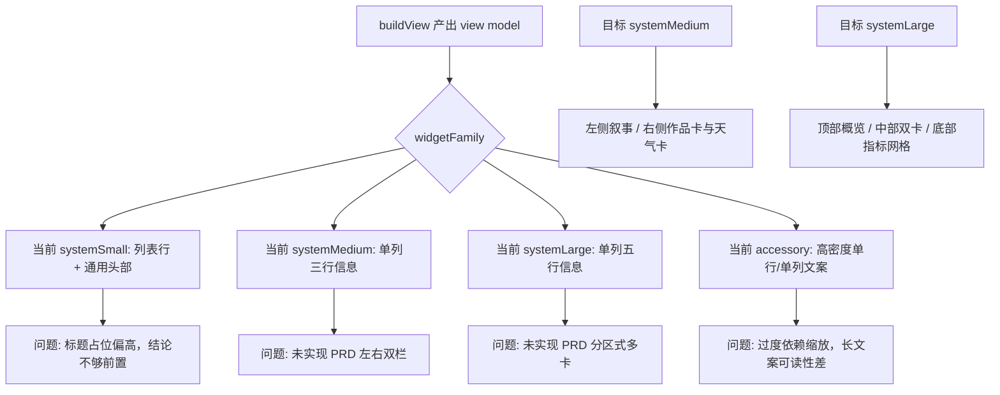

# City Painting UI 审查报告

## 1. 审查目标
- 检查 `modules/city-painting.js` 的多尺寸 UI 实现是否与既有 PRD 一致
- 识别真实渲染风险、信息层级问题和可维护性问题
- 输出可直接执行的修复方案，不改动当前业务逻辑

## 2. 审查范围
- 目标文件：`modules/city-painting.js`
- 对照文档：`prd/city-painting-widget.md`
- 参考规范：`standard_docs/egern_widgets.md`

## 3. 结论摘要
- 当前文件的数据获取与视图模型层基本稳定，问题集中在布局层
- `systemMedium` / `systemLarge` 没有落地 PRD 中定义的响应式结构
- 多处核心文本被强制单行裁切，导致“像哪幅画”的叙事价值被削弱
- 锁屏尺寸文案密度偏高，依赖极低 `minScale`，可读性不稳定
- 文件中保留了一套未接入的卡片式组件，说明 UI 重构停留在半成品状态

## 4. 当前实现与目标实现对比

## 5. 问题明细

### P1. 中大尺寸布局未按 PRD 落地
- 现状：
  - `buildMedium` 只是单列三行信息摘要
  - `buildLarge` 只是中号版的纵向放大
- 证据：
  - `prd/city-painting-widget.md` 明确要求 `systemMedium` 为左右双栏、`systemLarge` 为分区式多卡
  - 代码中 `heroCard`、`artworkPane`、`weatherSnapshotCard`、`weatherNarrativeCard` 已存在，但主渲染函数未接入
- 影响：
  - 中大尺寸的空间优势完全没有发挥出来
  - 作品结论、匹配理由、天气结构化信息混在同一列，视觉层次弱
  - 后续维护者难以判断应该沿用旧方案还是未接入的新方案
- 建议：
  - `systemMedium` 直接改为 `hstack([左侧叙事列, 右侧信息列])`
  - `systemLarge` 改为 `顶部 hero + 中部双卡 + 底部指标区`
  - 将已存在但未使用的卡片函数接入主流程；若决定不用，必须清理死代码

### P1. 核心文案被过度单行化，长标题和说明在大尺寸中仍然被截断
- 现状：
  - `cityFlatExpandedRow` 的 `value` 与 `detail` 都是 `maxLines: 1`
  - `buildLarge` 对 `artworkNote`、`reasonShort` 又做了一轮额外截断
- 影响：
  - 英文作品名普遍较长，最核心的“像《哪幅画》”会被截短
  - `systemLarge` 本应承载说明性内容，但当前仍然只能读到碎片
  - PRD 要求“作品名与一句匹配理由必须优先于数值天气”，当前实现相反
- 建议：
  - 大号尺寸中，作品名至少允许 `2` 行，理由允许 `2-3` 行
  - 中号尺寸左栏使用多行叙事，右栏保留单行结构化信息
  - 仅在锁屏尺寸保守截断，在主屏尺寸优先利用空间而不是压缩文本

### P2. 小尺寸头部信息冗余，结论没有成为首焦点
- 现状：
  - `systemSmall` 先渲染通用标题 `你的城市像哪幅画`，再展示作品与天气两行
  - 小尺寸最宝贵的垂直空间被通用品牌标题占用
- 影响：
  - 用户进入首屏后最先看到的是通用标题，不是城市结论
  - 与 PRD 的“小尺寸优先展示作品结论”不一致
- 建议：
  - 小尺寸头部只保留城市名，去掉通用长标题
  - 作品结论作为视觉主标题，天气与标签降为次级信息
  - 行标签如“作品”“天气”可以删除，减少列表感

### P2. 锁屏尺寸信息密度过高，依赖极低缩放比例兜底
- 现状：
  - `accessoryInline` 在一行中拼接城市名、作品名、标签
  - `accessoryRectangular` 第二行直接放完整作品名
  - 多处 `minScale` 降到 `0.52`、`0.68`
- 影响：
  - 长地名 + 长英文画名时，实际渲染会变得非常小
  - 锁屏 glance 场景下，用户读不到完整信息，只能看到缩小后的噪声文本
- 建议：
  - `accessoryInline` 改成“城市 + 像一幅 + 艺术家/短标题”的极短句
  - `accessoryRectangular` 改成两行固定模板，不要把天气和状态塞入同一主句
  - 锁屏优先保留“像哪幅画”的结论，不保留次要天气细节

### P2. 底部时间展示语义错误，显示的是当前时间而不是数据更新时间
- 现状：
  - `footer` 使用 `new Date().toISOString()` 生成相对时间
- 影响：
  - 组件无论用缓存还是刚刷新，底部时间都接近“现在”
  - 用户无法判断数据是否陈旧，缓存态视觉语义失真
- 建议：
  - 底部时间改为 `data.ts` 或天气接口的 `obsTime`
  - `live/cached` 与更新时间组合展示，形成完整状态认知

### P3. UI 代码存在明显死代码，增加后续修复风险
- 现状：
  - `heroCard`、`artworkPane`、`weatherSnapshotCard`、`compactInsightCard`、`weatherNarrativeCard`、`compactMetric`、`signalMetric`、`feelsLikeText` 未被任何主渲染路径调用
- 影响：
  - 文件可读性下降，真实生效的布局路径不清晰
  - 后续修改时容易误改未生效代码，造成“改了但没效果”的假象
- 建议：
  - 如果下一轮要重做 UI，优先复用这些卡片函数并统一命名
  - 如果不再使用，完成布局替换后立即删除死代码

## 6. 建议修复顺序
1. 先修 `systemMedium` / `systemLarge` 主结构，把 PRD 的双栏和分区式布局真正接上
2. 再修文本截断策略，区分主屏尺寸与锁屏尺寸
3. 再压缩 `systemSmall` 和 accessory 家族的文案密度
4. 最后清理未接入的旧 UI 组件，收敛文件结构

## 7. 验证建议

### 7.1 人工验收场景
- 长城市名：`呼和浩特新城区`
- 长作品名：`The Boulevard Montmartre on a Winter Morning`
- 锁屏 inline：检查是否还能在 glance 场景中读懂主结论
- 缓存态：断网后确认底部时间不再显示“刚刚”

### 7.2 验收标准
- `systemSmall` 首屏第一视觉焦点必须是“像《某幅画》”
- `systemMedium` 能明显看出左右分栏，不是单列列表
- `systemLarge` 能承载多行理由，而不是把理由压成一行
- `accessoryInline` 在长标题场景下仍保持可读
- 缓存态与实时态的状态标识和更新时间必须一致
