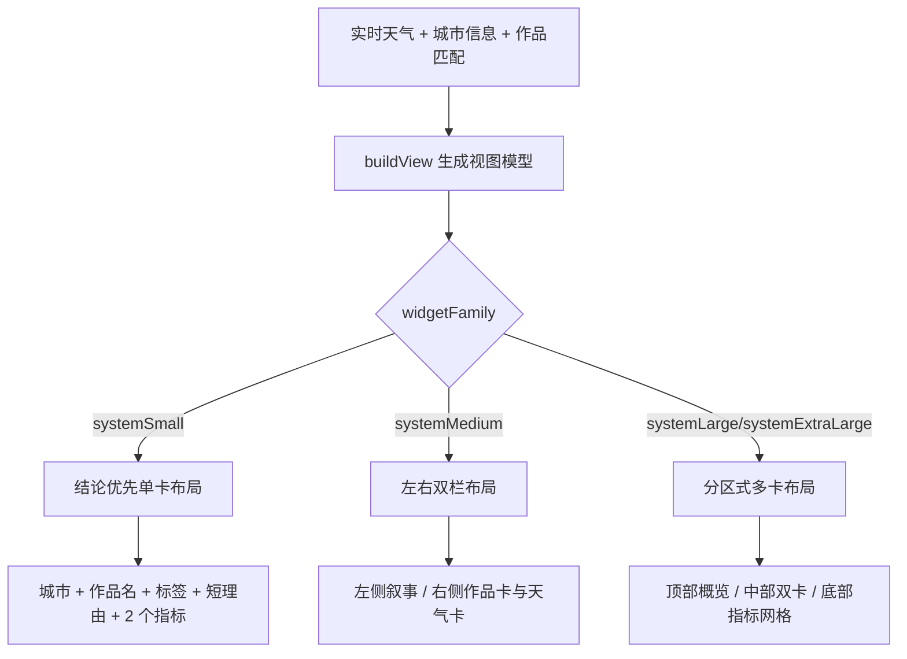

# 需求文档：你的城市像哪幅画小组件

## 1. 背景与目标
面向喜欢天气氛围、城市观察与艺术感表达的用户，提供一个把“城市当前气质”翻译成艺术作品的小组件。它不直接回答天气如何，而是回答一个更有趣的问题：**你所在的城市，此刻像哪幅画**。

**核心目标：**
- 基于实时天气、昼夜与季节信息，生成城市气质标签
- 从公开博物馆馆藏中匹配一件作品
- 在小组件中展示作品标题、作者、匹配理由与当前天气摘要
- 在 API 不可用时可退化到本地静态作品池

## 2. 用户画像与使用场景
- 城市观察者：想把天气从“功能信息”变成“情绪信息”
- 艺术爱好者：喜欢每天被推荐一件作品，而不是随机图
- 主屏审美用户：希望组件比天气卡片更有氛围感

典型场景：
- 早晨看主屏：知道今天的城市是“透纳式雾金色”还是“霍珀式冷清蓝”
- 下午截图分享：把所在城市和一幅名画并置，很容易形成记忆点
- 晚上锁屏 glance：快速看一句“今晚像哪种画”

## 3. 数据源与公开 API
### 3.1 天气数据
**Open-Meteo**
- 地理编码：
  - `https://geocoding-api.open-meteo.com/v1/search?name={city}&count=1&language=zh&format=json`
- 天气接口：
  - `https://api.open-meteo.com/v1/forecast?...`

建议字段：
- `current.temperature_2m`
- `current.is_day`
- `current.weather_code`
- `current.cloud_cover`
- `current.wind_speed_10m`
- `current.precipitation`

### 3.2 艺术数据
**The Metropolitan Museum of Art Collection API**
- 搜索作品：
  - `https://collectionapi.metmuseum.org/public/collection/v1/search?hasImages=true&q={keyword}`
- 获取作品详情：
  - `https://collectionapi.metmuseum.org/public/collection/v1/objects/{objectID}`

建议字段：
- `objectID`
- `title`
- `artistDisplayName`
- `primaryImageSmall`
- `objectDate`
- `medium`
- `department`

### 3.3 本地静态降级池
为避免搜索结果不稳定，内置一组精选作品映射关系：
- 晴朗金色：莫奈、梵高
- 雨夜城市：霍珀、毕沙罗
- 雾天灰蓝：透纳、惠斯勒
- 暴风雪：弗里德里希
- 暮色冷清：德加、霍珀

MVP 建议：
- 优先用本地静态映射池保证稳定
- 可选再从 Met API 补作品详情与图片

## 4. 产品定义
### 4.1 一句话卖点
把你所在城市此刻的天气和情绪，翻译成一幅最像它的画。

### 4.2 核心输出
- 今日匹配画作
- 作者
- 当前城市名
- 一句匹配理由
- 当前天气摘要
- 城市气质标签

### 4.3 识别维度
城市气质由以下变量组合：
- `weather_code`：晴、阴、雨、雪、雾
- `is_day`：白天 / 夜晚
- `cloud_cover`：通透、柔和、厚重
- `precipitation`：干燥、湿润、暴雨感
- `wind_speed_10m`：静止、流动、凌厉
- `temperature_2m`：冷暖基调

### 4.4 城市气质标签示例
- `金色午后`
- `玻璃雨夜`
- `冷蓝薄雾`
- `沉灰冬晨`
- `风暴前夕`
- `安静暮色`

### 4.5 匹配规则示例
- 晴天 + 低云量 + 白天 + 温暖：
  - 标签：`金色午后`
  - 作品方向：莫奈、梵高、雷诺阿
- 雨天 + 夜晚：
  - 标签：`玻璃雨夜`
  - 作品方向：霍珀、卡耶博特
- 雾天 + 低温：
  - 标签：`冷蓝薄雾`
  - 作品方向：透纳、惠斯勒
- 大风 + 多云 + 傍晚：
  - 标签：`风暴前夕`
  - 作品方向：弗里德里希、透纳

## 5. 功能需求
### 5.1 核心功能
- 支持按城市名查询地理坐标
- 获取当前天气
- 根据规则生成城市气质标签
- 为标签匹配一幅作品
- 输出“像哪幅画”的核心卡片

### 5.2 增强功能
- 支持 `RANDOMNESS`，在同标签下切换不同作品
- 支持 `PREFERRED_STYLE`，优先印象派/现实主义/夜景类
- 支持作品点击跳转到馆藏页
- 支持显示小图预览

### 5.3 缓存与刷新策略
- 天气刷新：默认 `30` 分钟
- 作品匹配缓存：默认 `12` 小时
- 若同一标签连续命中，可维持同一作品一天，减少频繁变化
- 天气请求失败时优先用缓存；作品接口失败时使用本地静态池

## 6. UI/UX 设计规范
### 6.1 视觉基调
- 风格：画框卡片 + 天气诗意摘要
- 主色：米白、深绿、赭石、蓝灰，依据匹配标签切换
- 重点：作品名与一句匹配理由必须优先于数值天气

### 6.2 布局适配
#### systemSmall
- 顶部：城市名
- 中部：作品名
- 底部：标签 + 简短天气

示例：
- `上海`
- `像《夜游者》`
- `玻璃雨夜 | 小雨 12°`

#### systemMedium
- 左侧：城市名、标签、匹配理由
- 右侧：作品标题、作者，若支持图片则显示缩略图
- 底部：天气摘要与状态

#### systemLarge
- 顶部：标题与城市
- 中部：大号标签 + 作品信息
- 底部：匹配理由、天气明细、作品年代/材质

#### accessoryCircular
- 中心：标签短词
- 小字：`像一幅画`

#### accessoryRectangular
- `上海 | 像《夜游者》`
- 次行：`玻璃雨夜`

#### accessoryInline
- 单行：`杭州今天像一幅透纳`

## 7. 组件参数（env）
- `TITLE`：标题，默认 `你的城市像哪幅画`
- `CITY`：城市名，必填
- `LAT` / `LON`：可选；若提供则跳过地理编码
- `ACCENT_COLOR`：强调色，可选
- `REFRESH_MINUTES`：天气刷新间隔，默认 `30`
- `ART_REFRESH_HOURS`：作品刷新间隔，默认 `12`
- `FORCE_REFRESH`：是否强制刷新
- `PREFERRED_STYLE`：偏好风格，可选值如 `impressionism`、`night`、`storm`
- `SHOW_IMAGE`：是否展示作品图，默认 `false`
- `OPEN_URL`：点击组件跳转链接，可选

## 8. 状态与异常处理
- **正常：**
  - 展示城市、作品、理由、天气
- **天气失败：**
  - 用缓存天气与上次标签
- **艺术接口失败：**
  - 从本地静态作品池返回结果
- **城市无法识别：**
  - 显示配置提示：`请检查 CITY`
- **图片缺失：**
  - 仅展示文字卡，不影响主流程

## 9. 实现建议
### 9.1 模块拆分
- `resolveLocation(ctx, env)`
- `fetchCurrentWeather(ctx, location)`
- `deriveMoodTag(weather)`
- `pickArtworkByMood(tag, stylePreference)`
- `fetchMetObjectIfNeeded(ctx, artwork)`
- `buildReason(tag, weather, city)`
- `buildSmall/buildMedium/buildLarge`

### 9.2 本地作品池建议结构
```json
[
  {
    "id": "nighthawks",
    "tag": "玻璃雨夜",
    "title": "Nighthawks",
    "artist": "Edward Hopper",
    "year": "1942",
    "image": "",
    "keywords": ["night", "city", "rain", "solitude"]
  }
]
```

### 9.3 匹配理由示例
- `低云和微雨把街道压成了霍珀式的冷静夜色`
- `午后阳光很薄，城市像一幅还没干透的莫奈`
- `风大、云低、光线发灰，像透纳画里暴风雨来前的港口`

## 10. 验收标准
- 输入合法城市名时，可稳定输出“标签 + 作品 + 理由”
- 即使艺术接口失败，仍可依靠本地作品池完整渲染
- 小尺寸中必须优先展示“作品结论”，而不是天气数字
- 相似天气条件下输出相对稳定，不频繁抖动
- 当天气明显变化时，标签和画作能自然切换

## 11. 里程碑
1. 接入城市解析与天气接口
2. 完成天气到气质标签的规则映射
3. 建立本地作品池并实现选择逻辑
4. 接入 Met API 作为作品详情增强
5. 完成多尺寸布局与异常兜底

## 12. 交付清单
- 小组件脚本：`modules/city-painting.js`
- 组件配置：`city-painting.yaml`
- 需求文档：`prd/city-painting-widget.md`

## 13. 2026-03-18 响应式布局优化留痕
### 13.1 本轮目标
- 仅优化 UI 与布局层，不改变天气获取、情绪标签映射和作品匹配主流程
- 强化 `systemSmall` / `systemMedium` / `systemLarge` 三种主屏尺寸的信息层级差异
- 让“结论感”优先于“指标堆砌”，同时保留天气与缓存状态可读性

### 13.2 布局策略
#### systemSmall
- 首屏只保留 4 类信息：城市、结论画作、情绪标签、最关键天气摘要
- 原则：先让用户一眼看到“这座城市像哪幅画”，再补一句短理由和两个简指标

#### systemMedium
- 改为左右双栏
- 左栏承载叙事：城市、作品结论、情绪标签、匹配理由
- 右栏承载结构化信息：作品卡、天气摘要、关键指标

#### systemLarge
- 改为分区式布局，而不是简单放大中号版
- 顶部概览区展示结论与标签
- 中部双卡分别展示作品信息和判断理由
- 底部指标区展示湿度、风速、降水、云量

### 13.3 响应式信息流


### 13.4 兼容性要求
- 长城市名必须可缩放或截断，不得挤爆头部布局
- 长作品名最多展示 2 行，超长时通过 `minScale` 降级
- 缓存态与实时态必须保留明确视觉标识
- 天气字段缺失时继续渲染占位文本，不中断主视图
