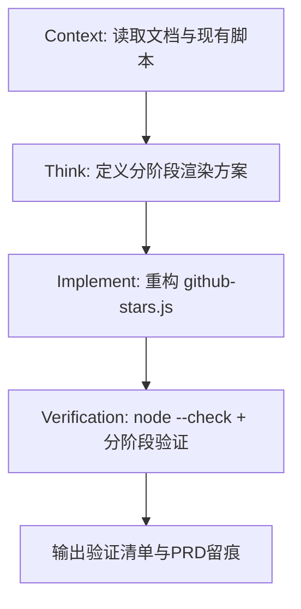

# GitHub Stars 小组件空白问题修复记录（文档对齐版）

## 1. 背景与问题
- 现象：`github-stars.yaml` 对应小组件出现空白卡片。
- 已知：抓包显示 GitHub API 请求为 200，但 UI 未渲染内容。
- 目标：严格按照 Egern 官方文档支持的 Widget DSL 与 JavaScript API 重构脚本，确保“失败可见、结果可见”。

## 2. 设计原则（本次重构）
1. **最小可渲染优先**：先保证 `widget + text` 一定显示。
2. **分阶段渲染**：通过 `RENDER_STAGE` 实现渐进式启用 UI。
3. **异常可视化**：任何失败都返回错误卡片文本，不再出现空白。
4. **串行请求控内存**：保留串行请求策略，避免 OOM 风险。
5. **缓存兜底**：网络失败自动回落 `ctx.storage.getJSON` 缓存数据。

## 3. 执行流程图（C.T.I.V）


## 4. 核心改动
文件：`modules/github-stars.js`

- 新增分阶段渲染参数 `RENDER_STAGE`：
  - `0`：最小模板（仅根容器+文本）
  - `1`：标题行
  - `2`：标题+数字
  - `3`：完整布局（标题+数字+柱图）
- 保留并重构 GitHub 数据拉取逻辑：
  - 仓库总星数 `/repos/{repo}`
  - 星标历史 `/stargazers` 串行分页抽样
- 新增统一异常捕获与 UI 回退：
  - 顶层 `try-catch`
  - 请求、JSON 解析、缓存读写均有异常处理
- 柱图实现仅使用文档明确支持属性：
  - `stack` / `text` / `spacer`
  - `direction` / `flex` / `gap` / `height` / `borderRadius` / `backgroundColor`

## 5. 验证流程（必须按顺序）

### Step A：最小模板验证（排除运行时/挂载问题）
在模块环境变量中加入：

```yaml
RENDER_STAGE: "0"
```

预期：小组件显示 `Star-History Ready · <title>` 文本。

### Step B：标题行验证（排除 stack 基础布局问题）

```yaml
RENDER_STAGE: "1"
```

预期：显示标题 + repo 文本。

### Step C：数字行验证（排除 API 与文本渲染问题）

```yaml
RENDER_STAGE: "2"
GITHUB_REPO: "apache/flink"
```

可选（防止限流）：

```yaml
GITHUB_TOKEN: "<你的本地测试 token>"
```

预期：显示星标总数；若 API 出错则显示错误卡片，不会空白。

### Step D：完整柱图验证

```yaml
RENDER_STAGE: "3"
SAMPLE_POINTS: "15"
CHART_COLOR: "#E36209"
```

预期：显示标题、星标数字、柱图、状态文本（实时/缓存）。

## 6. 回归检查清单
- [ ] 无 `GITHUB_REPO` 时，显示“配置缺失”错误卡片。
- [ ] GitHub API 非 200 时，显示“数据获取失败”错误卡片。
- [ ] 网络失败且有缓存时，显示缓存数据并有告警文本。
- [ ] 网络失败且无缓存时，不空白，显示错误文本。
- [ ] `node --check modules/github-stars.js` 通过。

## 7. 本地语法检查
已执行：

```bash
node --check ./modules/github-stars.js
```

结果：通过（exit code 0）。
