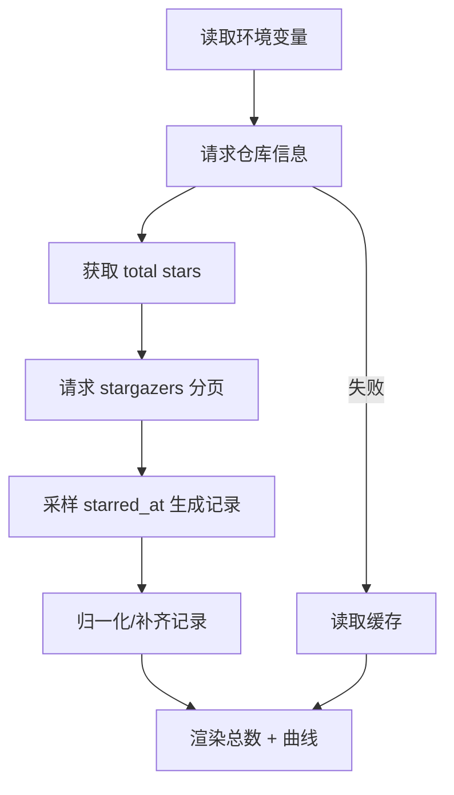

# GitHub Stars 小组件增强 PRD

## 1. 背景与问题
- 当前 [`modules/github-stars.js`](modules/github-stars.js:1) 仅显示总 Star 数，历史曲线未展示。
- 原因：历史数据生成逻辑为模拟数据，且图表渲染使用固定柱状布局，无法体现真实时间序列。

## 2. 目标
- 同时显示：总 Star 数 + Star 历史增长曲线。
- 历史曲线使用 GitHub 官方 API `stargazers` 的 `starred_at` 字段采样生成。
- 兼容 Egern Widget DSL，保证不会出现空白组件。
- UI 更精美，信息层级清晰。

## 3. 需求范围
### 3.1 功能
1. 读取仓库 Star 总数。
2. 获取历史 Star 增长采样点（分页采样）。
3. 渲染曲线/柱状趋势图，体现增长趋势。
4. 缓存降级：失败时使用缓存数据。
5. 可配置样式：标题、颜色、采样点数。

### 3.2 配置项
- `GITHUB_REPO`: 必填，形如 `vuejs/vue`。
- `GITHUB_TOKEN`: 可选，避免 API 速率限制。
- `TITLE`: 可选，标题显示。
- `COLOR_1` / `COLOR_2`: 背景渐变色。
- `CHART_COLOR`: 曲线/柱体颜色。
- `SAMPLE_POINTS`: 采样点数，范围 6~30。

## 4. 方案设计
### 4.1 数据流

### 4.2 历史采样策略
- 读取第一页，解析 `Link` 头获取总页数。
- 基于总页数与 `SAMPLE_POINTS` 计算采样页集合。
- 对每页取首条 `starred_at`，构造 `{count, date}` 记录。
- 增加 `total` 作为最后一个记录点，确保曲线收敛。

### 4.3 UI 方案
- 顶部：标题 + repo + 实时/缓存状态。
- 左侧：总 Star 数。
- 右侧：曲线/柱状趋势（高度固定，避免 iOS 高度塌陷）。
- 底部：里程碑进度条。

## 5. 风险与边界
- GitHub API 限速：需提示使用 Token。
- 仓库 Star 极少：曲线应至少有 1 个点。

## 6. 验证方式
- 使用公开仓库 `vuejs/vue` 配置运行。
- 对比总数显示与 GitHub 页面一致。
- 曲线能显示明显增长趋势。
