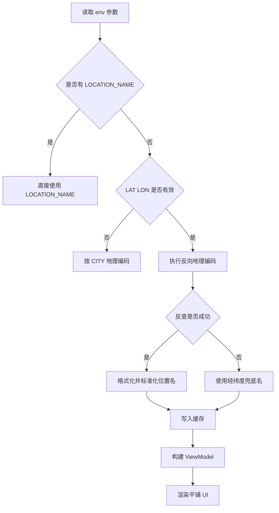

# 月相与天文夜卡修复与平铺 UI 改版方案

## 1. 目标范围
- 仅输出方案，不改动代码
- 聚焦文件：`modules/moon-astronomical-night.js`
- 结果包含
  - 定位名称显示为 当前地点 的根因分析
  - 可执行修复方案
  - 平铺式 UI 改版方案
  - 验证清单

## 2. 现状与根因

### 2.1 现状链路
在经纬度模式下，位置名链路为：
1. 读取 `LAT/LON`
2. 调用 `resolveLocation`
3. 调用 `fetchReverseLocationName`
4. 调用 `formatReverseGeoName`
5. 若结果为空则回退为 当前地点

### 2.2 根因判断
根因不是 LAT/LON 未生效，而是 位置名解析链路存在回退空值后直接使用默认文案 的设计。

主要触发点：
1. 反向地理编码接口偶发失败或超时，返回空字符串
2. 地址字段映射覆盖不足，部分地区返回字段未被拼接
3. 缓存命中后会沿用旧 location.name，导致历史回退值持续展示

## 3. 修复方案

### 3.1 位置名解析分层策略
按优先级返回：
1. `LOCATION_NAME` 手工指定
2. 反向地理编码解析名
3. 经纬度兜底名

兜底名建议使用：
- 北纬30.5027 东经104.0336

这样可避免再次出现不可解释的 当前地点。

### 3.2 反向地理编码健壮化
1. 请求参数增强
   - 增加 `addressdetails=1`
   - 适当上调 `zoom`
2. 字段映射扩展
   - city town county city_district suburb borough village township state province municipality
3. 结果标准化
   - 去重
   - 截断长度
   - 中文优先

### 3.3 缓存自愈策略
在缓存命中且 `location.name` 为 当前地点 时：
1. 允许触发一次轻量反查刷新
2. 刷新成功后覆盖缓存
3. 刷新失败继续展示旧值并打日志

### 3.4 日志与可观测性
新增调试日志维度：
- reverse_geocode.status
- reverse_geocode.provider
- reverse_geocode.fallback_used
- location.name.source

## 4. 平铺式 UI 改版方案

### 4.1 设计目标
- 信息扁平
- 读数优先
- 低认知负担
- 与现有深色夜空主题一致

### 4.2 信息层级
一级信息：
- 月相
- 照亮
- 夜窗
- 纯暗

二级信息：
- 夜间状态短句
- 日出 日落
- 天文夜边界

三级信息：
- 地点
- 数据状态 实时或缓存

### 4.3 systemMedium 布局草案
- 顶部：标题 + 时间
- 中部：2x2 平铺指标格
  - 左上 月相
  - 右上 照亮
  - 左下 夜窗
  - 右下 纯暗
- 底部：地点 + 状态

### 4.4 systemLarge 布局草案
- 顶部：标题 + 状态副标题
- 中部：5 行平铺信息行
  - 地点
  - 月相
  - 今晚夜窗
  - 纯暗时长
  - 日出 日落
- 底部：时间边界说明

### 4.5 视觉规范
- 颜色
  - 主强调色沿用 `theme.accent`
  - 文本主色 `#F7FAFF`
  - 次级文本 `rgba(228,235,245,0.62)`
- 节奏
  - 指标项间距统一 6
  - 主容器左右内边距统一 16
- 组件统一
  - 复用 `moonFlatCompactRow` 与 `moonFlatExpandedRow`
  - 减少视觉噪点，不引入额外装饰图层

## 5. 方案流程图

## 6. 验证方案

### 6.1 功能验证
1. 输入 `LAT=30.5027` `LON=104.0336`，地点应非 当前地点
2. 断网或接口失败时，地点应显示经纬度兜底名
3. 设置 `LOCATION_NAME=成都高新区` 时应稳定显示手工名
4. 命中缓存后不应长期卡在 当前地点

### 6.2 UI 验证
1. `systemMedium` 指标信息需一屏读完
2. `systemLarge` 行信息不换行或仅可控换行
3. 对比改版前，视觉层级更扁平，主读数更醒目

### 6.3 回归验证
- `accessoryCircular` `accessoryRectangular` `accessoryInline` 不受破坏
- 无 API Key 模式保持可用
- AstronomyAPI 图像模式保持可用

## 7. 实施清单
1. 重构位置名解析优先级与兜底
2. 扩展反向地理编码字段映射
3. 增加缓存自愈逻辑
4. 调整 medium 和 large 平铺布局
5. 执行功能验证与回归验证
6. 更新小组件文档说明
