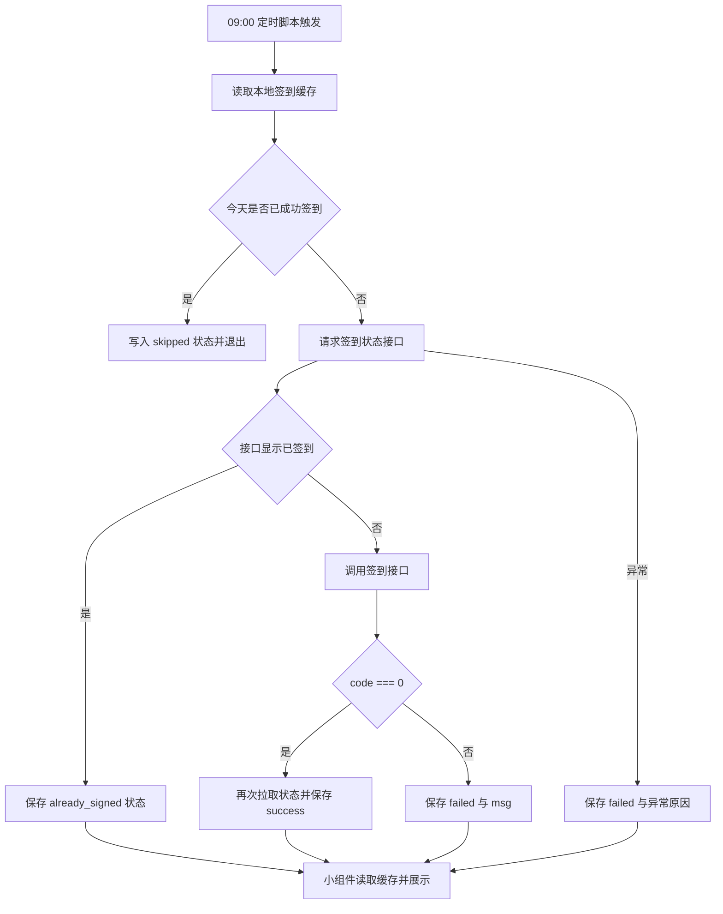

# Ninebot 签到小组件重构方案

## 1. 背景

当前 [`modules/ninebot-widget.js`](../modules/ninebot-widget.js) 主要实现车辆列表、动态信息和 token 缓存，但用户已明确要求：

- 去掉原有车辆信息相关代码
- 仅保留签到能力
- 依据参考仓库 `waistu/Ninebot` 的实现方式接入真实签到接口
- 将签到成功 / 失败结果显示在小组件上
- 失败时显示原因
- 每天早上 9 点自动执行签到

## 2. 外部证据

参考仓库 `https://github.com/waistu/Ninebot` 中已确认的签到链路：

- 签到状态接口：`GET https://cn-cbu-gateway.ninebot.com/portal/api/user-sign/v2/status?t=<timestamp>`
- 签到接口：`POST https://cn-cbu-gateway.ninebot.com/portal/api/user-sign/v2/sign`
- 请求头核心字段：`Authorization`、`Origin`、`Referer`、`from_platform_1`、`language`、移动端 `User-Agent`
- 请求体核心字段：`deviceId`
- 成功判定：返回 JSON 中 `code === 0`
- 已签到判定：状态接口返回 `data.currentSignStatus === 1`

## 3. 目标

### 3.1 功能目标

1. 小组件只展示“今日签到状态”与“最近一次结果”
2. 每日早上 9 点执行一次签到任务
3. 失败结果持久化，供小组件展示原因
4. 若今日已签到，避免重复提交
5. 不再依赖旧版登录、设备列表、车辆动态接口

### 3.2 非目标

- 不再展示电量、锁车、在线状态、多车摘要
- 不再使用用户名密码登录换 token
- 不实现额外抓包自动化，仍由用户提供 `Authorization` 与 `Device ID`

## 4. 方案设计



## 5. 代码落地

### 5.1 [`modules/ninebot-widget.js`](../modules/ninebot-widget.js)

重写为单文件双入口：

- 当存在 `ctx.cron` 时，按 schedule 脚本执行签到任务
- 当存在 `ctx.widgetFamily` 时，按 generic 脚本渲染小组件

核心职责：

- 统一封装请求头与 HTTP 请求
- 标准化签到状态结构
- 将结果写入 `ctx.storage`
- 为不同尺寸输出简洁的 Widget DSL

### 5.2 [`ninebot-widget.yaml`](../ninebot-widget.yaml)

调整为：

- 保留一个 generic 脚本注册
- 新增一个 schedule 脚本注册，`cron: "0 9 * * *"`
- 两个 scripting 都复用同一份 [`modules/ninebot-widget.js`](../modules/ninebot-widget.js)
- 删除旧版 `USERNAME`、`PASSWORD`、`PRIMARY_DEVICE_ID` 等环境变量说明
- 新增签到所需环境变量说明

## 6. 环境变量

计划保留以下最小环境变量：

- `TITLE`：小组件标题，可选
- `AUTHORIZATION`：抓包得到的 Ninebot `Authorization` 请求头值，必填
- `DEVICE_ID`：抓包得到的设备 ID，必填
- `OPEN_URL`：点击小组件后的跳转链接，可选
- `TIMEOUT_MS`：请求超时，可选
- `NOTIFY_ON_SUCCESS`：定时签到成功后是否通知，可选
- `NOTIFY_ON_FAILURE`：定时签到失败后是否通知，可选
- `FORCE_CHECKIN`：手动强制忽略本地成功缓存，可选

## 7. 存储结构

计划使用键：`ninebot_checkin_v2`

```json
{
  "dateKey": "2026-04-01",
  "status": "success",
  "title": "签到成功",
  "message": "连续签到 5 天",
  "consecutiveDays": 5,
  "checkedAt": "2026-04-01T09:00:03.000+08:00",
  "source": "schedule",
  "lastError": "",
  "raw": {}
}
```

状态枚举：

- `pending`
- `success`
- `already_signed`
- `skipped`
- `failed`

## 8. 验收标准

1. [`modules/ninebot-widget.js`](../modules/ninebot-widget.js) 不再包含车辆列表、车辆动态、旧登录逻辑
2. 定时配置改为每天早上 9 点执行签到
3. 成功后小组件显示成功文案和连续签到信息
4. 失败后小组件显示失败状态和原因
5. 缺少配置时小组件显示明确缺失项
6. 同日重复执行时不会重复签到，除非显式开启 `FORCE_CHECKIN`

## 9. 风险

- `Authorization` 依赖抓包结果，过期后需要用户重新更新
- Ninebot 服务端可能调整风控字段或请求头要求
- 若 Egern schedule 的时区与设备系统时区不一致，可能影响 9 点触发时间

## 10. 验证计划

1. 做静态语法校验
2. 通过构造 `ctx.storage` 假数据验证 widget 渲染输出
3. 检查 YAML 是否存在 generic + schedule 双注册
4. 人工核对 cron 是否为 `0 9 * * *`
