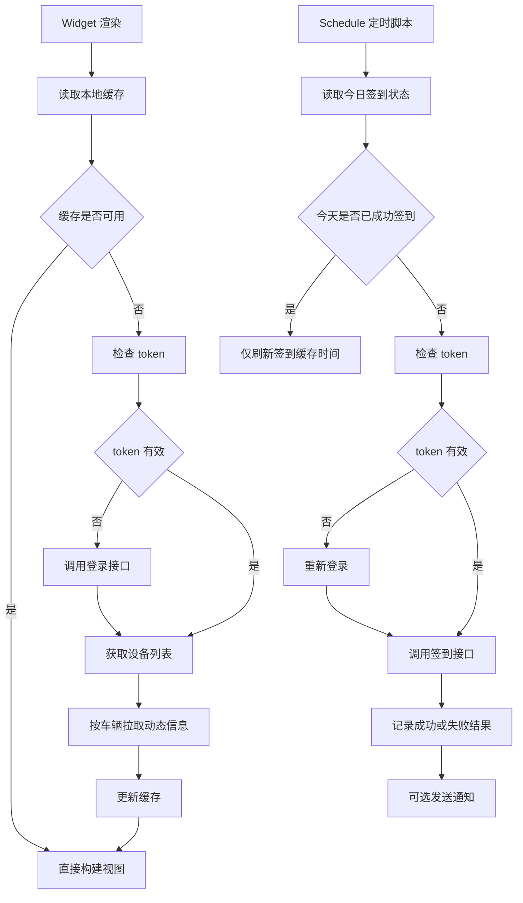

# Ninebot Egern 小组件方案

## 1. 目标与边界

### 1.1 目标
基于 [`ha_ninebot`](https://github.com/Wuty-zju/ha_ninebot) 当前已暴露的 Ninebot 云端接口，设计一个纯本地的 Egern 方案，满足以下目标：

- 在 [`generic`](../standard_docs/egern_widgets.md) 小组件中展示 Ninebot 车辆信息
- 支持多车账号：小尺寸展示主车，中大尺寸展示多车摘要
- 通过 Egern 本地脚本与定时任务完成登录态维护、缓存、刷新与每日自动签到
- 失败时优先降级到缓存，避免小组件空白

### 1.2 已确认边界

- 不依赖 Home Assistant 实体或中间层
- 需要真正执行 Ninebot App 每日积分或成长值签到
- 首版按多车方案设计
- 小组件能力与布局遵守 [`skills/egern-widgets/SKILL.md`](../skills/egern-widgets/SKILL.md) 与 [`standard_docs/egern_widgets.md`](../standard_docs/egern_widgets.md)

---

## 2. 从仓库确认到的 Ninebot API 与能力边界

### 2.1 已在仓库中明确出现的云端接口
根据已读取到的 [`custom_components/ninebot/const.py`](https://raw.githubusercontent.com/Wuty-zju/ha_ninebot/main/custom_components/ninebot/const.py) 与 [`custom_components/ninebot/api.py`](https://raw.githubusercontent.com/Wuty-zju/ha_ninebot/main/custom_components/ninebot/api.py) 线索，当前仓库至少明确使用了以下 Ninebot 云端接口：

| 分类 | 基址 | 路径 | 作用 | 方案中的用途 |
| --- | --- | --- | --- | --- |
| 登录 | `https://api-passport-bj.ninebot.com` | `/v3/opencloud/user/login` | 用户登录，获取后续接口访问凭据 | 初始化登录态、登录失效自动续期 |
| 设备列表 | `https://cn-cbu-gateway.ninebot.com` | `/app-api/inner/device/ai/get-device-list` | 拉取账号下设备清单 | 构建车辆列表、主车选择、多车摘要 |
| 设备动态信息 | `https://cn-cbu-gateway.ninebot.com` | `/app-api/inner/device/ai/get-device-dynamic-info` | 拉取单车实时动态 | 电量、锁车、信号、在线状态、充电状态等主展示数据 |

### 2.2 从集成平台可推断出的数据域
从 [`custom_components/ninebot/const.py`](https://raw.githubusercontent.com/Wuty-zju/ha_ninebot/main/custom_components/ninebot/const.py) 可见平台包含 `sensor`、`lock`、`binary_sensor`、`image`、`number`、`button`，从 [`custom_components/ninebot/button.py`](https://raw.githubusercontent.com/Wuty-zju/ha_ninebot/main/custom_components/ninebot/button.py) 可见存在信息刷新按钮。这说明当前仓库围绕以下能力组织数据：

- 账号登录与登录态缓存
- 车辆列表获取
- 单车动态信息刷新
- 车辆锁状态
- 二值状态类字段
- 图片或品牌资源展示
- 数值类传感器
- 手动刷新能力

### 2.3 当前方案中最重要的结论
当前仓库已足够支撑只读类车辆信息小组件，但**每日签到接口并未在已见仓库文件中直接暴露**。这意味着：

1. 车辆信息展示方案可以直接依据现有仓库接口设计并落地
2. 每日签到必须额外补足真实签到接口、请求头、鉴权规则与成功判定逻辑
3. 首版实现时必须把签到能力设计成独立适配层，避免与车辆数据逻辑耦合

---

## 3. 核心风险与设计原则

### 3.1 风险

- 登录接口可能不只需要用户名密码，还可能依赖设备标识、区域、签名或特殊请求头
- 签到接口不在当前仓库中，需后续补抓包或补公开资料验证
- 纯 Egern 方案没有 Home Assistant 协调器，必须自行处理 token、过期、重试、缓存与降级
- 多车账号下若逐车动态拉取过多，可能导致小组件超时

### 3.2 设计原则

- 账号认证、车辆读取、签到执行三层分离
- 优先交付稳定的只读信息展示，再叠加签到
- 默认缓存优先，接口异常时使用 [`ctx.storage`](../standard_docs/egern_javascript_api.md) 回退
- 所有网络请求都做超时、重试上限、鉴权失效重登录与错误可视化
- 小尺寸不做多车挤压，中大尺寸做平铺摘要

---

## 4. 推荐模块拆分

首版建议拆成 3 个文件：

- `modules/ninebot-widget.js`
  - [`generic`](../standard_docs/egern_widgets.md) 小组件脚本
  - 负责读缓存、必要时拉取车辆数据、生成各尺寸 DSL
- `modules/ninebot-checkin.js`
  - [`schedule`](../standard_docs/egern_javascript_api.md) 定时脚本
  - 负责定时登录、执行签到、更新签到状态缓存、必要时发通知
- `ninebot-widget.yaml`
  - 注册脚本、小组件与环境变量示例

如果后续发现鉴权逻辑过重，再拆一个内部共享层：

- `modules/ninebot-core.js`
  - 登录、请求封装、缓存编解码、日期键处理、错误规范化

---

## 5. 数据流与执行流程



---

## 6. 认证与缓存策略

### 6.1 存储结构
通过 [`ctx.storage`](../standard_docs/egern_javascript_api.md) 保存以下键：

- `ninebot_auth_v1`
  - 登录返回的 token、cookie、过期时间、用户 ID
- `ninebot_devices_v1`
  - 设备列表快照
- `ninebot_dynamic_v1`
  - 各车辆动态信息，按设备 ID 建索引
- `ninebot_checkin_v1`
  - 今日签到状态、签到时间、返回码、消息、奖励信息
- `ninebot_meta_v1`
  - 主车 ID、上次全量刷新时间、最近错误摘要

### 6.2 token 处理规则

- 小组件渲染时先读缓存，不为每次渲染强制登录
- 若 token 不存在、过期或请求返回鉴权失败，则自动登录一次
- 登录成功后更新 `ninebot_auth_v1`
- 连续登录失败时保留旧缓存并在 UI 中显示 `登录失效` 状态

### 6.3 数据刷新策略

- 设备列表：默认 6 到 24 小时刷新一次
- 设备动态信息：默认 10 到 20 分钟刷新一次
- 小组件渲染优先读取最近动态缓存
- 若当前为中大尺寸，仅请求前 N 辆车动态信息，避免超时
- 默认使用 `refreshAfter` 控制推荐刷新时间

---

## 7. 每日签到方案

### 7.1 方案结构
每日签到不和小组件渲染绑死，而是交给独立的 [`schedule`](../standard_docs/egern_javascript_api.md) 脚本执行：

- 优点 1：避免小组件渲染时顺带签到，造成不可控副作用
- 优点 2：便于按日期幂等控制
- 优点 3：可以单独记录签到结果并通知

### 7.2 调度策略

- 默认每日早上执行一次，例如 `15 0 * * *`
- 时间解释按用户时区处理，目标是北京时间每日一次
- 脚本先检查今日是否已签到成功
- 若已签到成功则直接退出，不重复提交
- 若失败则保留失败原因，允许下次调度再尝试

### 7.3 签到适配层设计
在代码结构上定义独立接口：

- `ensureAuth` 负责登录与凭据续期
- `performCheckin` 只负责调用签到接口
- `parseCheckinResult` 负责把返回值标准化为：
  - `success`
  - `already_done`
  - `failed`
  - `reward`
  - `message`

### 7.4 当前落地前提
由于当前仓库未直接暴露签到接口，首版开发前必须额外补齐以下证据：

- 签到接口基址与路径
- 请求方法
- 必需 header
- 是否需要 token、cookie、签名、设备 ID、region、nonce
- 成功与已签到的判定字段

### 7.5 失败降级

- 签到失败不影响车辆信息展示
- UI 只展示最近一次签到状态，不阻塞主数据
- 若连续失败，可由 [`ctx.notify`](../standard_docs/egern_javascript_api.md) 发送简短告警

---

## 8. 小组件信息架构

### 8.1 视图模型
建议统一归一成以下视图结构：

```text
account
  checkin
  vehicles[]
    id
    name
    sn
    isPrimary
    battery
    lockStatus
    chargingStatus
    signal
    online
    updatedAt
    thumb
```

### 8.2 systemSmall
仅展示主车：

- 顶部：标题 + 今日签到状态
- 中部：主车名称 + 电量
- 下部：锁车状态、在线状态、信号
- 底部：更新时间或缓存状态

### 8.3 systemMedium
展示主车 + 其他车辆摘要：

- 左列：主车详情
- 右列：其余 1 到 2 辆车的紧凑列表
- 页脚：今日签到结果 + 数据刷新状态

### 8.4 systemLarge
展示账号级总览 + 多车列表：

- 顶部：账号标题、签到状态、最近错误摘要
- 中部：主车重点行
- 下部：其余车辆平铺列表，展示电量、锁状态、更新时间
- 底部：缓存提示、最近签到时间

### 8.5 锁屏规格

- `accessoryCircular`
  - 主车电量或锁状态
- `accessoryRectangular`
  - 主车名称 + 电量 + 今日签到状态
- `accessoryInline`
  - `主车 82% 已签到` 之类短句

---

## 9. 环境变量设计

建议在 `ninebot-widget.yaml` 中暴露如下 `env`：

| 变量名 | 必填 | 说明 |
| --- | --- | --- |
| `TITLE` | 否 | 组件标题，默认 `Ninebot` |
| `USERNAME` | 是 | Ninebot 登录账号 |
| `PASSWORD` | 是 | Ninebot 登录密码 |
| `PRIMARY_DEVICE_ID` | 否 | 主车设备 ID，不填时自动取第一辆 |
| `REFRESH_MINUTES` | 否 | 车辆动态缓存刷新间隔 |
| `DEVICE_LIST_REFRESH_HOURS` | 否 | 设备列表刷新间隔 |
| `CHECKIN_CRON` | 否 | 每日签到 cron |
| `CHECKIN_NOTIFY` | 否 | 是否发送签到通知 |
| `MAX_VEHICLES` | 否 | 中大尺寸最多渲染车辆数 |
| `FORCE_REFRESH` | 否 | 调试用，忽略缓存 |
| `OPEN_URL` | 否 | 点击小组件跳转的 App Scheme 或网页 |

> 安全建议：账号密码只放在模块 `env` 中，不写死进脚本。

---

## 10. 首版实现步骤

1. 在 [`prd/`](../prd) 中固化方案文档
2. 新建 `modules/ninebot-widget.js`，实现认证封装、设备列表、设备动态读取、缓存与多尺寸 DSL
3. 新建 `ninebot-widget.yaml`，注册 [`generic`](../standard_docs/egern_widgets.md) 小组件与 `env`
4. 在确认 Egern `schedule` 配置格式后，新建 `modules/ninebot-checkin.js`
5. 接入真实签到接口并实现按天去重
6. 追加错误卡、空状态、缓存降级与通知
7. 完成多尺寸 UI 校验

---

## 11. 验收标准

### 11.1 车辆信息

- 账号下至少一辆车时，small 可稳定展示主车信息
- medium 与 large 可展示多车摘要且不重叠
- 登录失效、网络失败时优先展示缓存
- 无缓存时展示可读错误卡

### 11.2 每日签到

- 同一天只执行一次成功签到
- 签到成功后 UI 可展示 `已签到`
- 已签到重复执行时可识别为 `already_done`
- 签到失败不影响车辆信息展示

### 11.3 可维护性

- 登录、车辆请求、签到逻辑相互解耦
- 缓存键、错误码、日期键统一
- 所有网络请求都具备超时和错误处理

---

## 12. 当前待确认项

### 必须确认

1. Ninebot 每日签到真实接口与鉴权方式
2. Egern `schedule` 脚本在模块 YAML 中的最终声明格式
3. 登录接口是否需要除账号密码外的额外设备指纹字段

### 可以在开发中默认处理

- 主车默认取 `PRIMARY_DEVICE_ID`，否则取设备列表第一辆
- 中尺寸最多展示 3 辆车，大尺寸最多展示 5 辆车
- 签到结果在 UI 中使用简短文本，不展示过多奖励细节

---

## 13. 建议的实施结论

这个需求可以拆成两个阶段：

- 阶段一：基于仓库已确认 API 完成稳定的 Ninebot 信息小组件
- 阶段二：在补齐真实签到接口后接入自动签到脚本

原因不是实现复杂度，而是**当前仓库已确认的接口只足够支撑登录与车辆信息读取，尚不足以直接完成积分签到闭环**。从架构上先把签到能力独立出来，可以保证即使签到接口后续变动，也不会影响车辆信息主链路。
