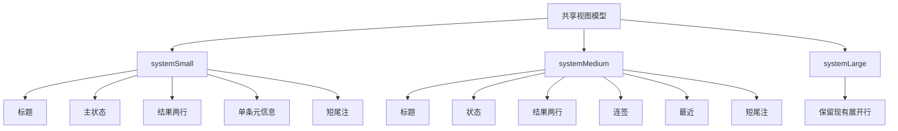

# Ninebot Widget 中小尺寸布局修复方案

## 1. 结论

[`modules/ninebot-widget.js`](../modules/ninebot-widget.js) 当前的大号布局可保留，问题集中在 [`buildSmall()`](../modules/ninebot-widget.js#L506) 与 [`buildMedium()`](../modules/ninebot-widget.js#L526) 的信息密度失控。

本次修复建议不走继续微调字号的路线，而是直接切到更稳的平铺降级方案：

- `systemSmall` 只保留标题、主状态、结果摘要、单条元信息、短尾注
- `systemMedium` 只保留标题、状态、结果、连签、最近、短尾注
- 长说明和脚本运行提示只保留在 [`buildLarge()`](../modules/ninebot-widget.js#L551)
- 删除中小尺寸中的重复时间、重复说明和长操作文案

这条路线符合 [`skills/egern-widgets/references/layout-playbook.md`](../skills/egern-widgets/references/layout-playbook.md) 中“出现重叠时直接切平铺模式”的规则。

---

## 2. iOS 主屏 Widget 常见尺寸范围

苹果主屏 WidgetKit 的 `systemSmall / systemMedium / systemLarge` 不是单一固定像素值，而是随 iPhone 机型变化的点尺寸。公开开发者资料和常见机型汇总可归纳为以下范围：

| family | 常见点尺寸范围 | 说明 |
| --- | --- | --- |
| `systemSmall` | 约 `155 × 155 pt` 到 `170 × 170 pt` | 正方形，可用高度非常有限 |
| `systemMedium` | 约 `329 × 155 pt` 到 `364 × 170 pt` | 宽度增加，但高度与 small 同级 |
| `systemLarge` | 约 `329 × 345 pt` 到 `364 × 382 pt` | 近似上下堆叠两个 small |

### 2.1 常见机型档位

| 机型档位 | `systemSmall` | `systemMedium` | `systemLarge` |
| --- | --- | --- | --- |
| 窄档 | `155 × 155 pt` | `329 × 155 pt` | `329 × 345 pt` |
| 中档 | `158 × 158 pt` | `338 × 158 pt` | `338 × 354 pt` |
| 宽档 | `170 × 170 pt` | `364 × 170 pt` | `364 × 382 pt` |

### 2.2 对当前问题的直接含义

最关键的一点不是宽度，而是：

- `systemMedium` 比 `systemSmall` 只是更宽
- `systemMedium` 的高度并没有比 `systemSmall` 宽裕多少
- 任何把 `medium` 当成“小号加更多行”的实现，都会天然接近溢出边界

这正是 [`buildMedium()`](../modules/ninebot-widget.js#L526) 当前会截断的根因。

---

## 3. 当前实现的结构性问题

### 3.1 [`buildSmall()`](../modules/ninebot-widget.js#L506) 的问题

当前小号结构为：

1. 标题
2. `footerText`
3. 分隔线
4. 状态行
5. 结果行
6. 连签行
7. 最近时间行
8. `footer()`

问题点：

- 小号里放了 4 条信息行加 2 条说明行，明显超出 `systemSmall` 的安全信息密度
- `结果` 被允许到 `3` 行，单这一项就会拉高整块高度
- `最近` 已经展示一次时间，[`footer()`](../modules/ninebot-widget.js#L595) 又重复展示 `updatedText`
- `footerText` 与底部 `footer()` 语义重复，属于低优先级占位
- 垂直方向存在大量固定 `spacer`，在小高度下会直接吞掉可用内容空间

### 3.2 [`buildMedium()`](../modules/ninebot-widget.js#L526) 的问题

当前中号结构为：

1. 标题
2. 分隔线
3. 状态
4. 结果
5. 连签
6. 最近
7. 定时
8. 手动签
9. 手动查
10. `footer()`

问题点：

- 中号放了 7 条业务信息加尾部，已经接近 large 的信息量
- `手动签` 与 `手动查` 文案最长，且都允许两行，是主要截断来源
- 中号高度与 small 同级，但当前实现却按“多出 3 行”的思路在堆内容
- 标题后还存在连续的固定间距，进一步压缩正文高度

### 3.3 共享问题

[`infoRow()`](../modules/ninebot-widget.js#L602) 和 [`footer()`](../modules/ninebot-widget.js#L595) 在中小尺寸下还有两个共性风险：

- `labelWidth` 固定为 `44`，会持续挤压右侧可变文本空间
- `footer()` 强制把说明文本和更新时间塞进同一行，小尺寸横向也容易被挤爆

---

## 4. 代码层面的根因判断

### 4.1 问题不是个别字符串太长，而是布局策略错误

当前实现默认把同一套详细信息塞给所有主屏 family，只是做了少量 `maxLines` 区分。这种做法在 Widget 上风险很高，因为：

- family 间不是简单的同比例放大
- `systemMedium` 主要增加的是宽度，不是高度
- 动态状态文案长度不稳定，失败态和成功态差异很大

### 4.2 现有文案分层没有按优先级裁剪

以当前视图模型 [`buildViewModel()`](../modules/ninebot-widget.js#L385) 为例，字段优先级应当是：

1. `primary`
2. `secondary`
3. `streakText`
4. `updatedText`
5. `scheduleText`
6. `manualCheckinText`
7. `manualStatusText`
8. `footerText`

但 [`buildSmall()`](../modules/ninebot-widget.js#L506) 与 [`buildMedium()`](../modules/ninebot-widget.js#L526) 没有按这个优先级裁剪，而是直接顺序平铺，导致低优先级说明把高优先级空间吃掉。

---

## 5. 修复目标

### 5.1 目标

- `systemSmall` 与 `systemMedium` 绝不出现重叠
- 允许必要裁剪，但首屏必须保留签到状态判断能力
- 大号布局保持现状，仅做共享辅助函数级别的小幅收敛
- 所有动态文案都有明确的最大行数与收缩策略

### 5.2 不做的事

- 不在中小尺寸继续保留手动脚本长提示
- 不通过继续减小字号来硬塞全部信息
- 不恢复卡片式或多分区式布局

---

## 6. 推荐修复方案

### 6.1 `systemSmall` 方案

建议把 [`buildSmall()`](../modules/ninebot-widget.js#L506) 改成以下结构：

1. 标题 `1` 行
2. 主状态 `1` 行
3. 结果摘要 `2` 行
4. 单条元信息 `1` 行
5. 短尾注 `1` 行

#### 字段保留策略

| 层级 | 保留内容 | 说明 |
| --- | --- | --- |
| 必留 | `title` | 标识来源 |
| 必留 | `primary` | 第一眼判断签到状态 |
| 必留 | `secondary` | 最核心结果说明，限制 `2` 行 |
| 二选一 | `streakText` 或 `updatedText` | 成功态优先显示连签，失败态优先显示最近时间 |
| 可留 | 短尾注 | 用一句短语表达 `等待自动签到` 或 `可手动补签` |

#### 明确删除项

- `footerText` 的长版说明
- 单独的 `最近` 信息行
- [`footer()`](../modules/ninebot-widget.js#L595) 当前的双文本尾部
- 所有 `scheduleText`
- 所有手动脚本名提示

#### 视觉结构建议

- 标题和状态之间保留很小的固定间距
- 不再使用分隔线
- 主状态可配一个小图标，但不要再新增独立信息区
- 小号总可见文本块控制在 `5` 个以内

### 6.2 `systemMedium` 方案

建议把 [`buildMedium()`](../modules/ninebot-widget.js#L526) 改成以下结构：

1. 标题 `1` 行
2. 分隔线
3. 状态 `1` 行
4. 结果 `2` 行
5. 连签 `1` 行
6. 最近 `1` 行
7. 短尾注 `1` 行

#### 字段保留策略

| 层级 | 保留内容 | 说明 |
| --- | --- | --- |
| 必留 | `primary` | 当前状态 |
| 必留 | `secondary` | 核心结果摘要，限制 `2` 行 |
| 必留 | `streakText` | 中号还能承载这条信息 |
| 必留 | `updatedText` | 中号保留最近时间更有价值 |
| 可留 | 短尾注 | 用短语表达 `每天 09:00 自动签到` 或 `可手动补签` |

#### 明确删除项

- `manualCheckinText`
- `manualStatusText`
- 长版 `footerText`
- 任何重复展示的时间

#### 结构注意点

- 中号继续保留分隔线，帮助形成清晰层次
- `结果` 控制在 `2` 行，不再允许到 `3` 行
- 去掉标题后的多余固定空白
- 中号总信息行数控制在 `4` 到 `5` 条之间

### 6.3 `systemLarge` 方案

[`buildLarge()`](../modules/ninebot-widget.js#L551) 暂不重做，只建议做两点轻收敛：

- 与中小尺寸共享统一的短尾注文案生成函数
- 保留手动脚本提示，但避免再把时间重复显示到尾部和正文两处

---

## 7. 推荐的代码改动点

### 7.1 新增 family 级裁剪辅助函数

建议新增以下辅助层，而不是在每个构建函数里硬编码判断：

- `buildSmallSummaryMeta vm`
- `buildMediumFooterText vm`
- `buildCompactFooter vm`
- `compactSecondary value maxLen`

用途：

- 先在视图模型层把文案压缩到安全长度
- 再在布局层控制 `maxLines`
- 避免只靠布局层兜底，导致不同状态下高度波动过大

### 7.2 调整共享组件行为

#### [`infoRow()`](../modules/ninebot-widget.js#L602)

建议：

- 支持 family 传入更小的 `labelWidth`
- 中小尺寸默认把 `valueSize` 降为更稳的紧凑档
- `结果` 行之外，其余行统一强制单行

#### [`footer()`](../modules/ninebot-widget.js#L595)

建议：

- 改为可配置的紧凑尾部
- `systemSmall` 不再复用当前双列 `footer()`
- `systemMedium` 如保留 footer，也只展示一段短文本，不再同时展示时间

---

## 8. 验收标准

### 8.1 结构验收

- [`buildSmall()`](../modules/ninebot-widget.js#L506) 不再包含 `4` 条以上业务信息行
- [`buildMedium()`](../modules/ninebot-widget.js#L526) 不再包含手动脚本长说明
- [`footer()`](../modules/ninebot-widget.js#L595) 不再在中小尺寸重复展示 `updatedText`
- `结果` 之外的其他信息默认单行

### 8.2 视觉验收

需要覆盖以下状态分别人工查看：

- `success`
- `already_signed`
- `failed`
- `not_signed`
- `pending`

并分别在：

- `systemSmall`
- `systemMedium`
- `systemLarge`

确认：

- 无重叠
- 无底部被裁掉
- 无横向标签与内容互相挤压到不可读
- 标题、状态、结果始终可见

### 8.3 文案验收

- 中小尺寸不再出现完整脚本名
- 中小尺寸不再出现两次时间
- 长错误信息允许被摘要化，但必须保留错误语义

---

## 9. 实施步骤

1. 在 [`buildViewModel()`](../modules/ninebot-widget.js#L385) 旁新增中小尺寸用的短文案辅助函数
2. 重写 [`buildSmall()`](../modules/ninebot-widget.js#L506) 为 5 块以内的紧凑结构
3. 重写 [`buildMedium()`](../modules/ninebot-widget.js#L526) 为单列平铺结构
4. 把 [`footer()`](../modules/ninebot-widget.js#L595) 改造成可选紧凑模式，或中小尺寸不再复用
5. 保持 [`buildLarge()`](../modules/ninebot-widget.js#L551) 主体结构不变，仅做重复信息清理
6. 对 5 种状态分别做 small 和 medium 的目测验证

---

## 10. 布局降级示意

---

## 11. 最终建议

这次不建议在 [`buildSmall()`](../modules/ninebot-widget.js#L506) 和 [`buildMedium()`](../modules/ninebot-widget.js#L526) 上做继续试错式微调，而应直接按 family 做信息密度重构。

判断标准很明确：

- 大号已合理，无需推倒
- 中号高度并不比小号宽裕多少
- 小号和中号的正确修法都是删掉低优先级内容，而不是继续塞更多行

下一步应切到 `code` 模式，直接按本方案改 [`modules/ninebot-widget.js`](../modules/ninebot-widget.js)。
