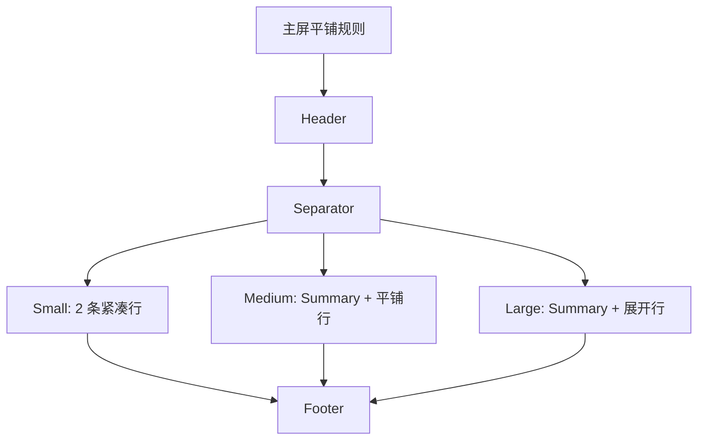

# 主屏平铺化重构说明

## 1. 目标

本次重构统一处理以下文件的主屏 UI：

- `modules/moon-astronomical-night.js`
- `modules/city-painting.js`
- `modules/commute-eta.js`

同时将“平铺防重叠”规则沉淀到：

- `skills/egern-widgets/SKILL.md`
- `skills/egern-widgets/references/layout-playbook.md`

## 2. 核心规则

当用户明确要求：

- 不要花哨
- 不要重叠
- 改成 `github-stars.js` 那种简单结构
- 主屏先保证稳定

则主屏尺寸统一切换到：

- `header`
- `separator`
- 平铺信息行
- `footer`

不再使用：

- hero card
- 环形主视觉
- 进度条主视觉
- 主卡 + 摘要卡 + 明细卡的嵌套结构

## 3. 各组件重构策略

### 3.1 月相与天文夜

- `systemSmall`：只保留 `月相`、`夜窗`
- `systemMedium`：使用一条夜间状态 summary，加两列短信息
- `systemLarge`：改成地点、月相、今晚夜窗、纯暗时长、日出日落的展开行

### 3.2 城市像哪幅画

- `systemSmall`：只保留 `作品`、`天气`
- `systemMedium`：只保留 `作品`、`天气`、`气质`
- `systemLarge`：增加 `作品注释`、`城市说明`

### 3.3 通勤 ETA

- `systemSmall`：只保留 `去公司`、`回家` 两条路线
- `systemMedium`：增加一条往返 summary，再展示两条展开路线
- `systemLarge`：增加 `往返综合` 行，但仍保持平铺，不恢复 route card

## 4. Mermaid 结构图

## 5. 验证要求

### 5.1 结构校验

- 主屏尺寸不再依赖 hero card / progress / circular visual 作为主体
- `systemMedium` 和 `systemLarge` 不再出现多卡片并排抢高度
- 平铺行中的动态文本都带 `maxLines` 和 `minScale`

### 5.2 人工视觉校验

- `moon-astronomical-night` 主屏不再出现月相图占满主体区
- `city-painting` 主屏不再出现作品卡、天气卡、叙事卡并列
- `commute-eta` 主屏不再出现 route card 和 info banner 抢高度
